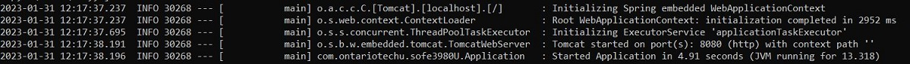

# Milestone2: Implementing and Testing Web Application and API Service using Apache Maven and Spring Boot
You will be guided to build a web application and an API service based on the Binary class you implemented in the first milestone.
## Repository:
[https://github.com/GeorgeDaoud3/SOFE3980U-Lab2](https://github.com/GeorgeDaoud3/SOFE3980U-Lab2)

## Objectives:
1. Use Maven to build a web application
2. Learn how to use Spring Boot to build and test Web applications.
3. Learn how to use Spring Boot to build and test API service.

## Create a WebApp Project
* You can create a web application project using Jenkins from the maven-archetype-webapp template (**DarchetypeArtifactId**) by running the following command in the command window in the path you want to generate the project in.
    ``` cmd
    mvn archetype:generate ^
    	-DgroupId=com.ontariotechu.sofe3980U ^
    	-DartifactId=Webapp ^
    	-Dversion=1.0.0 ^
    	-DarchetypeArtifactId=maven-archetype-webapp ^
    	-DinteractiveMode=false
    ```
* The command will generate a folder called **BinaryCalculatorWebapp**. The structure of the folder is shown in the following figure
    
    **index.jsp** is a java server page that generate a corresponding HTML file while **web.xml** is used to map an URL to the corresponding JSP file.
*	Change the current directory to **BinaryCalculatorWebapp**.
    ``` cmd
    cd BinaryCalculatorWebapp
    ```
## Adding the Spring Boot framework
The project will be updated to use the [Spring-Boot](https://spring.io/projects/spring-boot) framework instead of the default framework. Thus, both **index.jsp** and **web.xml** will not be functional anymore. In this section, The web application is set up. While in the next section, the framework will be investigated to understand how the web application works.  
*	Create the following folder and subfolder **java** and **java/com.ontariotechu.sofe3980U** within **src/main/** folder.
*	Copy the two files named **HelloController.java** and **Application.java** from the GitHub repository to the path **src/main/java/com.ontariotechu.sofe3980U** in your project.
*	Create a folder named **templates** within **src/main/resources/** folder in your project folder and copy the file named **hello.html** from the GitHub repository to the path **src/main/java/sources/templates** in the project.
*	The overall project folder should look like this:
    
    
*	Update the pom.xml file to include the following properties before the dependencies tag.  The **parent** tag provides a shared configuration of the spring boot dependencies (you can download the final version of **pom.xml** from the GitHub repository).
    ``` xml
    <parent>
    	<groupId>org.springframework.boot</groupId>
    	<artifactId>spring-boot-starter-parent</artifactId>
    	<version>2.1.2.RELEASE</version>
	    <relativePath/> <!-- lookup parent from repository -->
    </parent>
    ```
    and also, the following dependencies 
    ``` xml
    <dependency>
    	<groupId>org.springframework.boot</groupId>
    	<artifactId>spring-boot-starter-web</artifactId>
    </dependency>
    <dependency>
    	<groupId>org.springframework.boot</groupId>
    	<artifactId>spring-boot-starter-thymeleaf</artifactId>
    </dependency>	
    ```
    The updated pom file should look like
    
    
*	To run the application, run the following command
    ``` cmd
    mvn spring-boot:run
    ```
    The command will be running and blocking the command window as long as the web application needed to be run. If you want to stop it, press **Ctrl+C** (Don’t stop it right now).
     
*	Open a web browser and navigate to the following URL: [http://localhost:8080/hello](http://localhost:8080/hello)
    
*	Now try to navigate to the following URL: [http://localhost:8080/hello?name=Doe](http://localhost:8080/hello?name=Doe)
    
