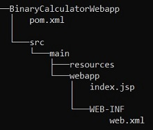
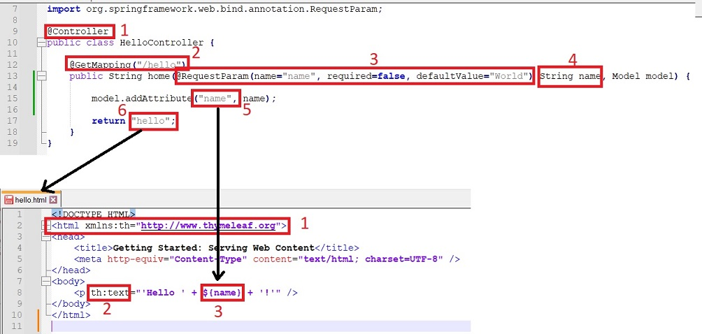
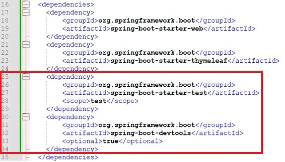
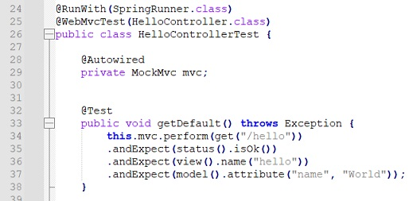
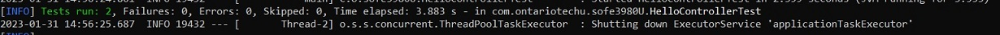
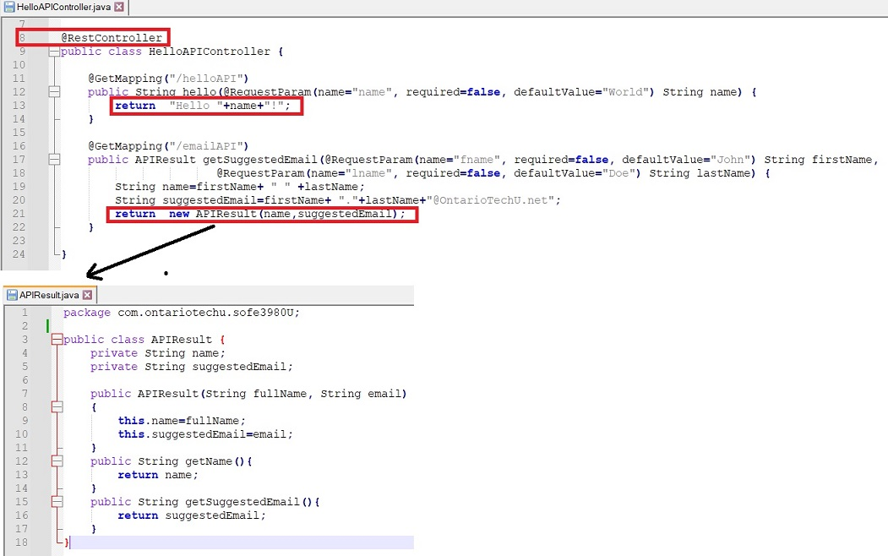
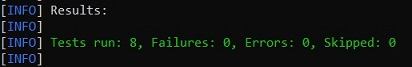

# Milestone 2: Implementing and Testing Web Application and API Service using Apache Maven and Spring Boot
You will be guided to build a web application and an API service based on the Binary class you implemented in the first milestone.
## Repository:
[https://github.com/GeorgeDaoud3/SOFE3980U-Lab2](https://github.com/GeorgeDaoud3/SOFE3980U-Lab2)

## Objectives:
1. Use Maven to build a web application
2. Learn how to use Spring Boot to build and test Web applications.
3. Learn how to use Spring Boot to build and test API service.

## Create a WebApp Project
* You can create a web application project using Jenkins from the maven-archetype-webapp template (**DarchetypeArtifactId**) by running the following command in the command window in the path you want to generate the project in.
	``` cmd
    mvn archetype:generate ^
    	-DgroupId=com.ontariotechu.sofe3980U ^
    	-DartifactId=BinaryCalculatorWebapp ^
    	-Dversion=1.0.0 ^
    	-DarchetypeArtifactId=maven-archetype-webapp ^
    	-DinteractiveMode=false
	```
* The command will generate a folder called **BinaryCalculatorWebapp**. The structure of the folder is shown in the following figure
    
	
  
	**index.jsp** is a java server page that generate a corresponding HTML file while **web.xml** is used to map an URL to the corresponding JSP file.
*	Change the current directory to **BinaryCalculatorWebapp**.
    ``` cmd
    cd BinaryCalculatorWebapp
    ```
## Adding the Spring Boot framework
The project will be updated to use the [Spring-Boot](https://spring.io/projects/spring-boot) framework instead of the default framework. Thus, both **index.jsp** and **web.xml** will not be functional anymore. In this section, The web application is set up. While in the next section, the framework will be investigated to understand how the web application works.  
*	Create the following folder and subfolder **java** and **java/com.ontariotechu.sofe3980U** within **src/main/** folder.
*	Copy the two files named **HelloController.java** and **Application.java** from the GitHub repository to the path **src/main/java/com.ontariotechu.sofe3980U** in your project.
*	Create a folder named **templates** within **src/main/resources/** folder in your project folder and copy the file named **hello.html** from the GitHub repository to the path **src/main/java/sources/templates** in the project.
*	The overall project folder should look like this:
    
    
*	Update the pom.xml file to include the following properties before the dependencies tag.  The **parent** tag provides a shared configuration of the spring boot dependencies (you can download the final version of **pom.xml** from the GitHub repository).
    ``` xml
    <parent>
    	<groupId>org.springframework.boot</groupId>
    	<artifactId>spring-boot-starter-parent</artifactId>
    	<version>2.1.2.RELEASE</version>
	    <relativePath/> <!-- lookup parent from repository -->
    </parent>
    ```
    and also, the following dependencies 
    ``` xml
    <dependency>
    	<groupId>org.springframework.boot</groupId>
    	<artifactId>spring-boot-starter-web</artifactId>
    </dependency>
    <dependency>
    	<groupId>org.springframework.boot</groupId>
    	<artifactId>spring-boot-starter-thymeleaf</artifactId>
    </dependency>	
    ```
    The updated pom file should look like
    
    
*	To run the application, run the following command
    ``` cmd
    mvn spring-boot:run
    ```
    The command will be running and blocking the command window as long as the web application needed to be run. If you want to stop it, press **Ctrl+C** (Don’t stop it right now).
    
     
* Open a web browser and navigate to the following URL: [http://localhost:8080/hello](http://localhost:8080/hello)
    
    
* Now try to navigate to the following URL: [http://localhost:8080/hello?name=Doe](http://localhost:8080/hello?name=Doe)
    
    

## Understanding Spring-Boot based Web application
* **Application.java** contains the **main** function that runs the web application
* **HelloController.java** is a view controller that redirects a HTTP request to a template HTML file to generate a customized HTML file.
* The first file in the following figure shows **HelloController.java**. 
    1. The **HelloController** class is defined after **@controller** annotation to indicate that it implements an view controller (Model–view–controller or MVC) that will respond by an Html page.
    2. **@GetMapping("/hello")** annotation indicates that the following function will be a handler to a **GET** request sent to the URL **/hello** ([http://localhost:8080/hello](http://localhost:8080/hello)).
    3. **@RequestParam** defines an argument that can be sent via the **GET** method. In this example, the argument is called **name**. It’s optional with a default value of **"World"**. Its value can be set by the URL as [http://localhost:8080/hello?name=Doe](http://localhost:8080/hello?name=Doe). 
    4. The value of the **GET** parameter will be handled by a java variable named **name**.
    5. **Model.addAttribute** is used to send a value (the second argument) from the java function to a variable (first argument) in the HTML template.
    6. The return value is the name of the html template file to be sent back as a response to the **GET** request. As it returns **"hello"**, the file **src/main/java/resources/templates/hello.html** will be used as a template to create the response.
* To use the HTML file as a template and uses the set variable to customize the view of the HTML file, Spring Boot uses **Thymeleaf**. It’s a modern server-side Java template engine. Taking the file  **src/main/java/sources/templates/hello.html** shown in the figure as example. when edited, it looks like a normal HTML file except:
    1. In the **html** tag, it has a reference to **Thymeleaf**.
    2. Each attribute that will be updated by Thymeleaf will be appended by **th:**. For example, the **text** attribute is replaced by **th:text** in line 8. 
    3. **Thymeleaf** will regenerate the string in line 8 by replacing the value of **${name}** with the value of the **name** variable set by the model. That’s how **Hello Doe!** was displayed as a respond to  [http://localhost:8080/hello?name=Doe](http://localhost:8080/hello?name=Doe).
* Finally, the **pom.xml** file is updated to add dependencies for both **Spring Boot** and **Thymeleaf**.
* The web application will be deployed also by **Maven** on a **Tomcat** server at the **localhost** at port **8080**.
    
    

## Testing the Web Application
To test the web application, we have to
1. Create  **test**, **test/java** and **test/java/com.ontariotechu.sofe3980U** folders within **src/** path.
2. Copy the file **HelloControllerTest.java** from the GitHub to the path **src/test/java/com.ontariotechu.sofe3980U** within the project.
    
    
3. Remove the **junit** dependency and add the following dependencies to the pom file
    ``` xml
    <dependency>
	<groupId>org.springframework.boot</groupId>
	<artifactId>spring-boot-starter-test</artifactId>
	<scope>test</scope>
    </dependency>	
    <dependency>
	<groupId>org.springframework.boot</groupId>
	<artifactId>spring-boot-devtools</artifactId>
	<optional>true</optional>
    </dependency>
    ```
    
    
4. **HelloControllerTest.java** contains two test cases. Both look similar. So, Only the first case will be discussed here
    * Line 25: specify the class to be tested.
    * Line 34 : performs a **GET** request to the URL **/hello**.
    * Line 35 : checks that the response is ok.
    * Line 36 : checks that the response uses the **hello.html** template.
    * Line 37 : checks that the attribute **name** within the template is set to the value **"World"**.
    
    
5. Run the test cases and deploy the web application
    ``` cmd
    mvn test spring-boot:run
    ```
    
    

## API Controller Using Spring Boot
The API controller works similar to the view Controller but it returns a data (string or JSON) instead of a view (HTML). 
1. Copy **HelloAPIController.java** and **APIResult.java** from the Github repository to the path **src/main/java/com.ontariotechu.sofe3980U**. As shown in the following figure, the API controller looks the same as the view controller except it uses **@RestController** instead of **@Controller**. It returns either a string as in line 13 or a JSON object ( represented by the APIResult object used in line 21) 
    
    
2. Copy **HelloAPIControllerTest.java** from the Github repository to the path **src/test/java/com.ontariotechu.sofe3980U**. It contains 6 test cases. Its test case is simpler than that of the view controller because there is no need for check the view or its parametes. The following figure shows 3 test cases.
    * Line 39 : checks the output string of the API to be **"Hello World!"**
    * Line 44: add a parameter to the GET Request similar to **/helloAPI?name=John**
    * Line 53 : checks the value of **name** field within the JSON object to be **"John Doe"** where **$** represents the root of the JSON object.
    
    
3. Run the test case and deploy the web application
    ``` cmd
    mvn test spring-boot:run
    ```
 
     
4. Try the following URLs
    * [http://localhost:8080/helloAPI](http://localhost:8080/helloAPI)
    * [http://localhost:8080/helloAPI?name=Jack](http://localhost:8080/helloAPI?name=Jack)
    * [http://localhost:8080/emailAPI?fname=Abraham](http://localhost:8080/emailAPI?fname=Abraham) 
    * [http://localhost:8080/emailAPI?lname=Lincoln](http://localhost:8080/emailAPI?lname=Lincoln) 
    * [http://localhost:8080/emailAPI?fname=Abraham&lname=Lincoln](http://localhost:8080/emailAPI?fname=Abraham&lname=Lincoln)
    * [http://localhost:8080/emailAPI](http://localhost:8080/emailAPI) 

## The Web Application of Binary Calculator
* It’s time to set up the Binary Calculator. Copy **Binary.java**, **BinaryController.java**, **BinaryAPIResult.java** and **BinaryAPIController.java** from the **BinaryCalculator** folder in the repository to the path **src/main/java/com.ontariotechu.sofe3980U** within your project folder.
* Copy **calculator.html**, **error.html**, and **result.html** from the **BinaryCalculator** folder within the repository to the path **src/main/resources/templates** within the project folder.
* Copy **BinaryControllerTest.java** and **BinaryAPIControllerTest.Java** from the **BinaryCalculator** folder in the repository to the path **src/test/java/com.ontariotechu.sofe3980U** in your project folder.
* Let’s try to understand how the binary calculator works.
    1. It start by navigate to [http://localhost:8080](http://localhost:8080) . Thus , a **GET** request will be send to the URL **“/”**. This will be handled by the **getCalculator()** function defined at the **BinaryController** class.
    2. The function shown in the figure below will display the view calculator. It can have one argument **operand1**. The value of **operand1** is used to set the first textbox in the view. If **operand1** is set, the second textbox will be focused. Otherwise, the first textbox will be focused. 
        
    3. Pressing the **=** button, will submit the values of **operand1**, **operator**, and **operand2** using a **POST** method to the same URl **“/”**. The Post Request is mapped to a **getResult()** function defined at the **BinaryController** class. 
    4. If the operator is invalid. The control will be directed to the **Error** view. However, The normal flow of the function is to calculate the result and display the **result** view. Note, only the **+** operator is implemented till now.
        
    5. An example of the result view is shown. It got two links that will be customized to GET the URL **“/”** with suitable parameters. In this example, **New Operation** will be redirected to [http://localhost:8080](http://localhost:8080) while **Continue calculation** will be redirected to [http://localhost:8080/?operand1=10000](http://localhost:8080/?operand1=10000). This will returns us back to first step.
 
* For the API services It’s implemented by BinaryAPIController.java. It has two functions to add binary functionsl one returns a string while the other returns a JSON object. Try the following URLs
    * [http://localhost:8080/add?operand1=111&operand2=1010](http://localhost:8080/add?operand1=111&operand2=1010) 
    * [http://localhost:8080/add_json?operand1=111&operand2=1010](http://localhost:8080/add_json?operand1=111&operand2=1010)	 
* **BinaryControllerTest.java** contains three test cases for the Web application while **BinaryAPIControllerTest.Java** provides two test cases for the API service.

## Design:
* Add three more test cases for the binary web application.
* Add three more test cases for the binary API service.
* Implement other operators ( *, &, I) in both the web application and the API services. To do so, replace the Binary.java file with that you have implemented in the first milestone. You don’t need to update any HTML files. Only the java files should be updated.
*  Add test cases for each newly implemented operations. The test cases should cover almost all possible cases.

## Deliverables:
1. A report consists of a summary of test cases, its target (class/function), and its purpose and a snap shot of the test summary provided by Maven. It should contain a link to a GitHub link for you project.
2. An audiable video of about 5 minutes of the running application and service showing almost all available functionalities.   
